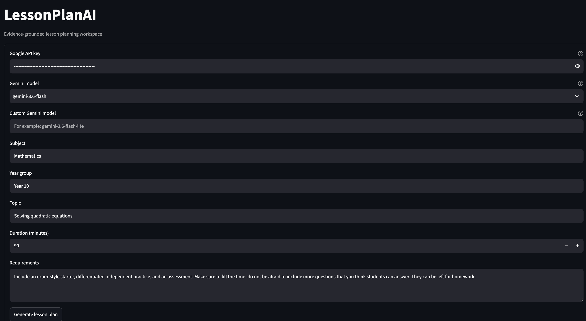

# LessonPlanAI

An AI-powered lesson planning assistant that helps teachers create evidence-based lesson plans in seconds.

This is the public repo - there are no documents. However, a demo is continuously deployed on an AWS EC2 instance





## What It Does

**LessonPlanAI** solves a real problem in the classroom: designing complete, high-quality lesson plans from scratch is time-consuming and often done from memory. This app speeds up the process by:

1. **Finding relevant curriculum content** – Searches through your scheme of work to find the most relevant topics, learning objectives, and activities for what you're planning to teach.

2. **Searches past exam questions** – Retrieves related questions from past exam papers, so your lesson connects to what students will actually be assessed on.

3. **Generating design critique** – Uses Google's Gemini AI to review your evidence and suggest improvements: differentiation strategies, alternative activities, assessment methods, and ways to scaffold student understanding.

4. **Producing a ready-to-use lesson plan** – Generates a complete, downloadable lesson plan document with learning objectives, starter activities, independent practice, formative assessment, and support strategies—all grounded in real curriculum and exam data.

The app does the research and drafting. The teacher reviews, customizes, and teaches.

## How It Works (Behind the Scenes)

The app demonstrates several practices:

- **Retrieval-Augmented Generation (RAG)**: Uses vector search and semantic matching to find relevant curriculum content and exam questions from a structured database
- **Evidence Grounding**: Every suggestion is traced back to the original source material so there is no hallucinated content
- **Structured Data**: Lesson plans are validated as Pydantic models, ensuring consistency and correctness
- **Production Ready**: Deployed on AWS EC2 with automated Docker builds and CI/CD via GitHub Actions

## Key Features

- **User-supplied Google API key and models** – You control your AI usage
- **Curriculum-aware** – Searches a structured database of learning objectives, content, and exam questions
- **Audit trail** – Every source is cited with document and location

## The Process: How It Works End-to-End

### 1. **Data Ingestion & Parsing**
The app begins by parsing curriculum documents (scheme of work) and exam question banks from DOCX and JSON formats using safe, schema-validated extraction. Each lesson objective, activity, and question is converted into a canonical Pydantic model with provenance tracking (which document it came from, exact location). This ensures:
- No data loss or format assumptions
- Clear audit trail for every piece of evidence
- Schema enforcement from day one

### 2. **Semantic Search with Vector Embeddings**
When a teacher enters their lesson topic, the app uses **sentence-transformers** (all-MiniLM-L6-v2) to convert both the query and all curriculum content into vector embeddings—dense mathematical representations of meaning. These embeddings are stored in **Qdrant**, a vector database optimized for similarity search.

**Why this approach over keyword search?**
- Keyword search would miss relevant content if the teacher uses different terminology than the curriculum document
- Embeddings capture semantic meaning: "calculate the area" retrieves "find the area of a rectangle" even though keywords don't match
- Qdrant is lightweight, can run locally or containerized, and scales smoothly from laptop to production without rebuilding indexes

### 3. **Retrieval-Augmented Generation (RAG)**
The top curriculum results and exam questions are passed to Google's Gemini AI along with a structured prompt. The AI has explicit instructions to:
- Use only the provided evidence
- Suggest improvements based on pedagogy, not hallucination
- Cite sources precisely

**Why RAG over fine-tuning?**
- Fine-tuning requires thousands of examples and is expensive to maintain
- RAG grounds every answer in your actual curriculum, so teachers trust the suggestions
- You can update curriculum data without retraining the model
- No risk of the AI inventing exam questions or content not aligned to your syllabus

### 4. **Structured Output Generation**
The AI's response is parsed into a validated **LessonPlan** Pydantic model with sections for objectives, activities, assessments, and differentiation. Each suggestion includes a source reference.

**Why structured data?**
- Ensures consistency: every lesson has the same sections in the same order
- Allows validation: catches errors before the teacher sees them
- Enables future features: export to different formats, integrate with classroom management systems
- Type safety: Python catches mistakes at import time, not when running

### 5. **Deployment & Production Readiness**
The entire application is containerized with Docker and deployed to AWS EC2 via an automated CI/CD pipeline.

## Technology Stack & Design Decisions

### **Python 3.11 + Pydantic**
- **Why Python?** Rapid prototyping, rich AI/ML ecosystem, easy to maintain and extend
- **Why Pydantic?** Type validation; catches data shape errors early; auto-generates schemas

### **Streamlit for Frontend**
- **Why Streamlit?** Fastest path from Python code to interactive UI; perfect for educators and non-technical users
- **Single-file app** – Teachers can see exactly how their data flows through the system

### **Google ADK**
- **Why Google ADK?** Provides structured tool orchestration; integrates multiple agents (curriculum retrieval, question search, lesson design) in a deterministic way

### **Qdrant Vector Database**
- **Why Qdrant over Pinecone or Weaviate?** 
  - Can run locally without cloud dependency
  - Minimal operational overhead (single Docker container)
  - Built-in filtering and reranking
- **Why vector search at all?** Semantic matching beats keyword search for educational content where phrasing varies

### **sentence-transformers (all-MiniLM-L6-v2)**
- **Why this model?** 
  - Small enough to run CPU-only (no GPU needed on EC2)
  - Fast inference (~10ms per embedding)
  - Trained on general English; works well for curriculum without fine-tuning
  - Open source, fully controlled

### **Docker + GitHub Actions + AWS EC2**
- **Why containerize?** Ensures the app runs identically on your laptop, CI/CD pipeline, and production server
- **Why EC2 (not Lambda or managed containers)?** 
  - Need persistent Qdrant instance for fast similarity search
  - Lesson generation can take 30+ seconds; Lambda has 15-min timeout but adds cold-start latency
  - EC2 gives full control over networking, security groups, and resource allocation

## Getting Started

```bash
# Set up
python3.11 -m venv .venv
source .venv/bin/activate
pip install -e .

# Run locally
streamlit run app/streamlit_app.py
```

Visit `http://localhost:8501`, enter a Google API key, and create your first lesson plan.

This project demonstrates:

1. **Full-stack development** – Data ingestion, search infrastructure, API orchestration, UI, and deployment
2. **AI/ML integration** – Real-world use of embeddings, vector search, and LLM agents
3. **Software engineering rigor** – Type safety (Pydantic), testing (pytest), linting (ruff), CI/CD pipelines
4. **AWS cloud infrastructure** – ECR, EC2, IAM, automated deployments
5. **Pedagogical thinking** – Understanding how teachers work and designing tools that serve real classroom needs

## AWS Configuration

The workflow in `.github/workflows/deploy.yml` builds the Docker image on every push to `main`, pushes it to AWS ECR (Elastic Container Registry), and deploys it to an EC2 instance via SSH.

**Configure these GitHub repository secrets:**
- `AWS_REGION` – e.g., `eu-west-1`
- `ECR_REPOSITORY` – your ECR repo name
- `AWS_ACCESS_KEY_ID` – dedicated IAM user's access key
- `AWS_SECRET_ACCESS_KEY` – dedicated IAM user's secret access key
- `EC2_HOST` – public or private IP of your EC2 instance
- `EC2_USER` – e.g., `ec2-user` or `ubuntu`
- `EC2_SSH_PRIVATE_KEY` – private key for EC2 access
- `EC2_SSH_PORT` (optional; defaults to 22)

**Before first deployment:**
1. Install Docker and AWS CLI on the EC2 instance
2. Optionally create `$HOME/lesson-plan-ai/.env` for `GOOGLE_API_KEY` and other runtime settings
3. Ensure the EC2 security group allows inbound TCP 8501 only from trusted networks
4. The workflow creates a persistent Docker volume for Qdrant data

The workflow is non-destructive: it stops the old container gracefully, starts the new one with health checks, and rolls back if the app doesn't respond within 30 seconds.
